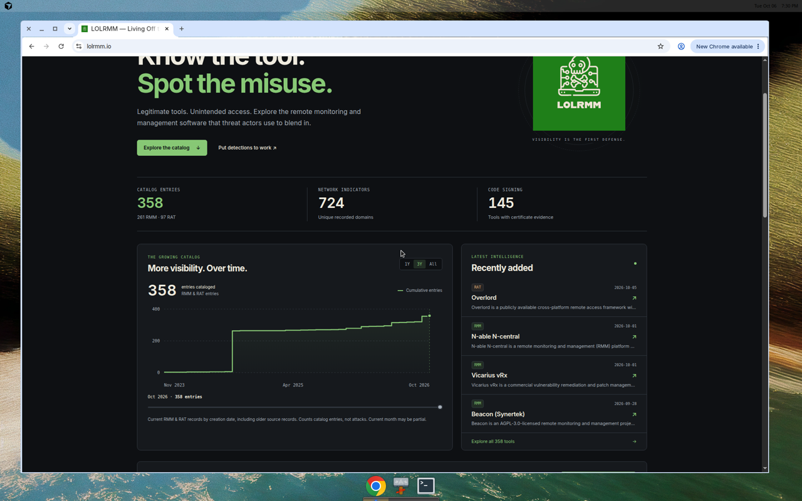

# LOLRMM - Living Off the Land Remote Monitoring and Management 🖥️🔍


Welcome to LOLRMM (Living Off the Land Remote Monitoring and Management), a community-driven project that provides a curated list of Remote Monitoring and Management (RMM) tools and Remote Access Trojans (RATs) that could potentially be abused by threat actors. Our mission is to assist security professionals in staying informed about these tools and their potential for misuse, providing the community a catalog of **358 entries** (**261 RMM** · **97 RAT**) which can be used for threat hunting, detection and prevention policy creations.



## 🌟 Key Features

- **Fast Astro-powered static site** at [lolrmm.io](https://lolrmm.io/) – browse the catalog, filter by platform, search by name/domain/artifact, and explore tool details with full JavaScript-free rendering
- **358 cataloged entries** broken down by classification: **261 RMM** tools and **97 RAT** (Remote Access Trojans)
- **724 network indicators** (unique domains) and **145 code-signing certificates** recorded for threat hunting and application control research
- **Cumulative growth chart** showing catalog expansion over time
- **Structured YAML source records** describing key details of each tool:
  - Tool name, description, author, and timestamps
  - Technical details (website, PE metadata, privileges required, etc.)
  - Supported operating systems and capabilities
  - Known vulnerabilities and installation paths
  - Artifacts left on disk, in event logs, registry, or network
  - Detection methods (including Sigma, Splunk, Defender, and Sysmon rules)
  - References and acknowledgements
- **JSON and CSV APIs** for programmatic access – fetch the full catalog, network domains, or individual tool records with no API key required
- **LLM-discoverable guide** at [lolrmm.io/llms.txt](https://lolrmm.io/llms.txt) for AI assistants and research automation
- **Generated Sigma detections** under `detections/` with process and DNS indicators automatically derived from catalog entries

## 🚀 Getting Started

To begin working with LOLRMM:

1. **Browse the catalog** at [lolrmm.io](https://lolrmm.io/) – explore by platform, filter by tool type, or search for specific artifacts
2. **Clone the repository** to work with the YAML source records directly
3. **Fetch via API** to integrate catalog data into your threat hunting and detection workflows

### API Usage

Fetch the complete catalog in JSON or CSV format (no API key required):

```bash
# Full catalog JSON with all tool details
curl https://lolrmm.io/api/rmm_tools.json

# CSV export for spreadsheet review
curl https://lolrmm.io/api/rmm_tools.csv

# Network domains for hunting
curl https://lolrmm.io/api/rmm_domains.csv

# Individual tool record
curl https://lolrmm.io/api/tools/anydesk.json
```

See [lolrmm.io/api/](https://lolrmm.io/api/) for the complete API documentation and additional feeds.

## Support 📞

Please use the [GitHub issue tracker](https://github.com/magicsword-io/LOLRMM/issues) to submit bugs or request features.

## 🤝 Contributing & Making PRs

Stay engaged with the LOLRMM community by regularly checking for updates and contributing to the project. Your involvement will help ensure the project remains up-to-date and even more valuable to others.

If you'd like to contribute, please follow these steps:

1. Fork the repository
2. Create a new branch for your changes
3. Make your changes and commit them to your branch
4. Push your changes to your fork
5. Open a Pull Request (PR) against the upstream repository

For more detailed instructions, please refer to the CONTRIBUTING.md file (if available). To create a new YAML file for an RMM tool, use the provided YAML templates in the `yaml` directory.

## 🚨 Sigma Detection

LOLRMM provides Sigma detection rules to help you effectively detect potential threats related to RMM tools. To explore these rules in detail, navigate to the `detections/sigma/` directory.

Happy hunting! 🕵️‍♂️

## 🏗️ Building and Testing Locally

### Requirements

* Python 3.12+ (PyYAML, or the existing Poetry environment)
* Node.js 22.19+

The website now uses Astro. From the repository root:

```sh
python3 -m venv .venv
source .venv/bin/activate
pip install pyyaml
cd website
npm ci
npm run dev
```

Visit `http://localhost:4321`. The dev/build commands regenerate data and detection
exports from `/yaml` automatically. To build and verify the static website:

```sh
npm run check
npm run build
npx playwright install chromium
npm test
```

Output is written to `website/dist/`. See [website/README.md](website/README.md)
for data routes, chart methodology, analytics configuration, and deployment details.

Join us in our quest to create a safer and more secure digital environment for organizations everywhere. With LOLRMM by your side, you'll be well-equipped to understand and address the potential risks associated with RMM tools in the ever-evolving cyber landscape.

## 🤖 GitHub Actions

### Purpose

The GitHub workflow files in the `.github/workflows` directory automate various tasks and processes for continuous integration, continuous delivery, and other project maintenance activities.
These workflow files leverage GitHub Actions to execute predefined steps based on specific triggers such as code pushes, pull requests, or scheduled intervals.

### Key Goals
- **Automate Testing**: Ensure that all code changes pass necessary tests before merging into the main branch.
- **Continuous Integration**: Automatically build and validate the project in different environments and configurations.
- **Code Quality Checks**: Run static analysis tools to maintain code quality and adherence to coding standards.
- **Deployment**: Manage the deployment process to various environments, ensuring seamless and reliable releases.
- **Badge Updates**: Automatically update project badges to reflect the current status, such as the number of Remote Monitoring and Management (RMM)

### Prerequisites
To create a `PUSH_TOKEN` for use in your GitHub Actions workflow, you'll need to generate a personal access token (PAT) on GitHub and then add it to your repository's secrets. Here's how to do it:

#### Steps to Create a Personal Access Token:
1. **Log in to GitHub**: Open your web browser and log in to your GitHub account.
2. **Generate a Token**:
   - Click on your profile picture in the top right corner and select "Settings".
   - In the left sidebar, click on "Developer settings".
   - Click on "Personal access tokens" and then "Tokens (classic)".
   - Click the "Generate new token" button.
   - Set a descriptive name for the token, like `PUSH_TOKEN`.
   - Select the appropriate scopes. At a minimum, you need `repo` scope for repository access.
   - Click "Generate token".
   - **Important**: Copy the token now and save it somewhere secure. You won't be able to see it again.

#### Steps to Add the Token to Your Repository's Secrets:
1. **Navigate to Your Repository**: Go to the main page of your repository on GitHub.
2. **Open Settings**:
   - Click on the "Settings" tab.
   - In the left sidebar, click on "Secrets and variables" and then "Actions".
3. **Add a New Secret**:
   - Click the "New repository secret" button.
   - Set the name of the secret to `PUSH_TOKEN`.
   - Paste the personal access token you generated earlier into the "Value" field.
   - Click "Add secret".

Now, your workflow file will use the `PUSH_TOKEN` from your repository secrets when it runs.

If you follow these steps, your `PUSH_TOKEN` should be correctly created and accessible for your GitHub Actions workflow.
